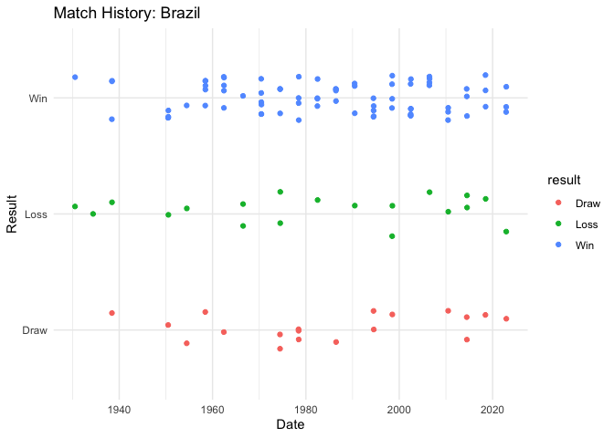

<!-- README.md is generated from README.Rmd. Please edit that file -->

# worldcupR

<!-- badges: start -->
<!-- badges: end -->

The top 8 teams in the world cup are relatively well-known by pundits,
but a lot of uncertainty remains as to who will finally lift the trophy.
The goal of worldcupR is to simulate a World Cup knockout tournament
based on historical match data from previous world cups by focusing on
teams’ historical scoring strength to predict the outcomes of the
upcoming World Cup.

## Installation

You can install the development version of worldcupR like so:

``` r
devtools::install_github("Svenbeck-maastricht/worldcupR")
```

## Example

This is a basic example which shows you how to solve a common problem:

``` r
library(worldcupR)
library(dplyr)
#> 
#> Attaching package: 'dplyr'
#> The following objects are masked from 'package:stats':
#> 
#>     filter, lag
#> The following objects are masked from 'package:base':
#> 
#>     intersect, setdiff, setequal, union
library(doParallel)
#> Loading required package: foreach
#> Loading required package: iterators
#> Loading required package: parallel
## basic example code
teams <- c("Brazil", "Germany", "France", "Netherlands", "Argentina", "Spain", "England", "Portugal")
#historical statistic for a team
team_summary("Brazil")
#>     team matches wins losses draws goals_scored goals_conceded
#> 1 Brazil     114   76     19    19          237            108
#simulate a tournament
simulate_tournament(teams)$champion
#> [1] "Portugal"
#run simulations (500) either sequentially or parallel
winners <- tournament_seq(teams)
winners <- tournament_par(teams)
#> Warning: executing %dopar% sequentially: no parallel backend registered
table(winners)
#> winners
#>   Argentina      Brazil     England      France     Germany Netherlands 
#>           4          21           5          30         218          72 
#>    Portugal       Spain 
#>         126          24
```

# Full Analysis

For a complete example including parallel simulation, benchmarking, and
win probability plots, see ‘worldcup_analysis.R’ in the project root

\#Plot team history



In that case, don’t forget to commit and push the resulting figure
files, so they display on GitHub and CRAN.
